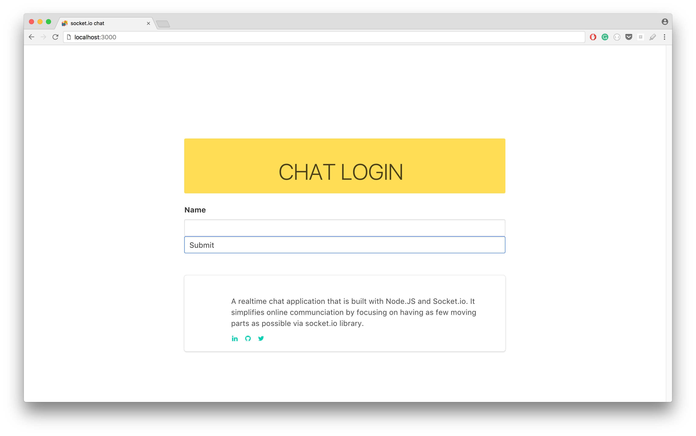
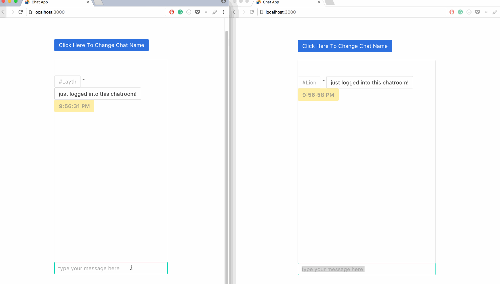

## Simple Chat Application Built in Node.js and Socket.io

This is a basic chat application that utilizes `Node.JS` and `socket.io`. Web sockets in general allow `messages` to be pushed to other connected clients on the server.

## Socket Connections

```javascript
io.on('connection', function(socket){
  console.log('a user connected');
});

http.listen(3000, function(){
  console.log('listening on *:3000');
});

```



- - -

